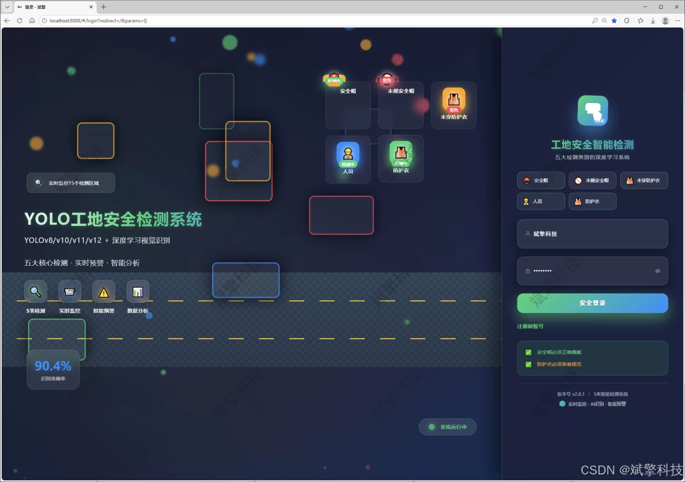
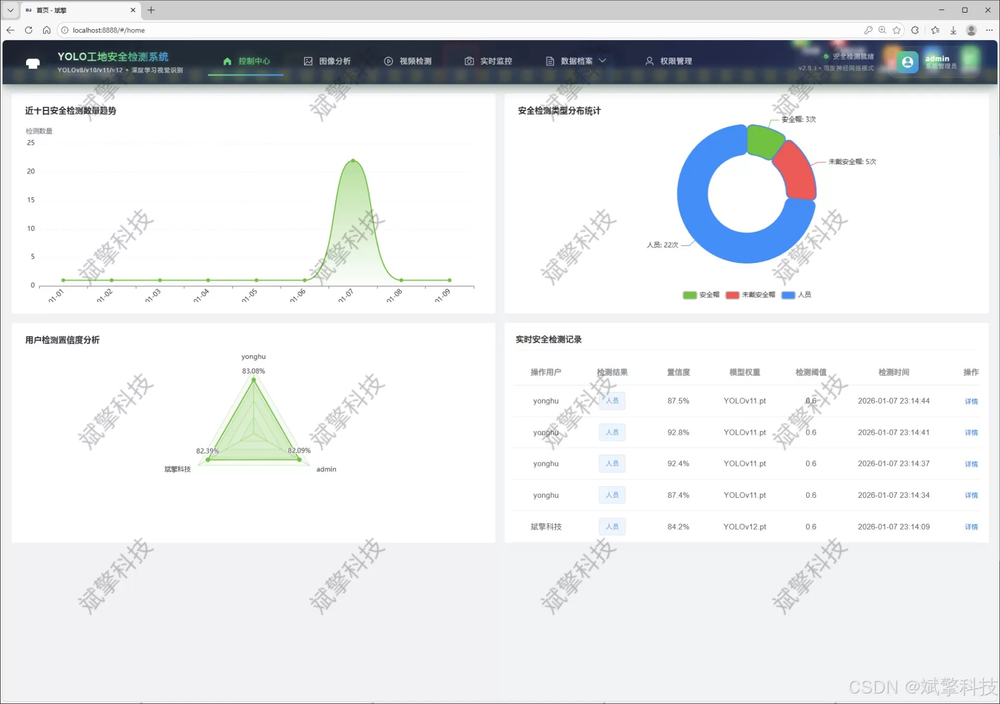
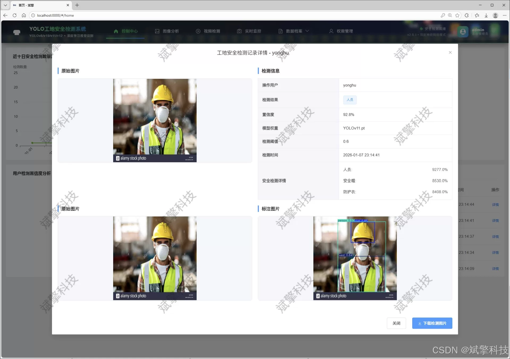
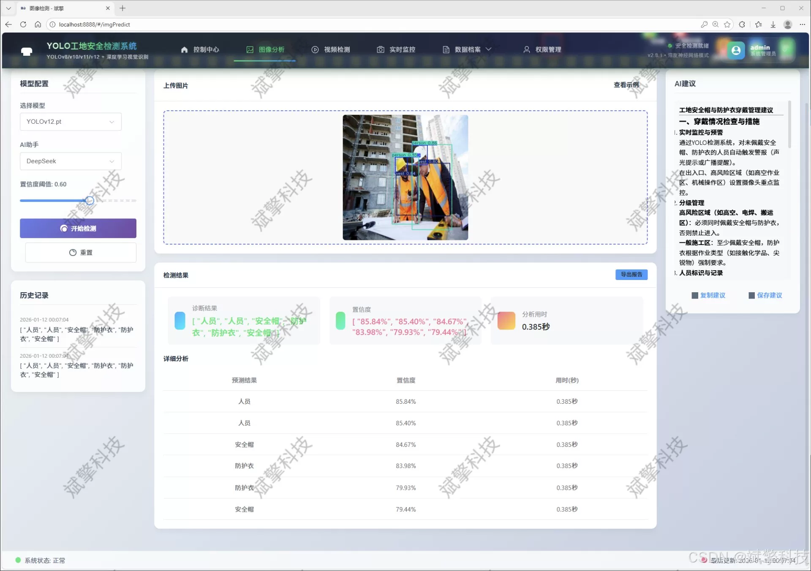
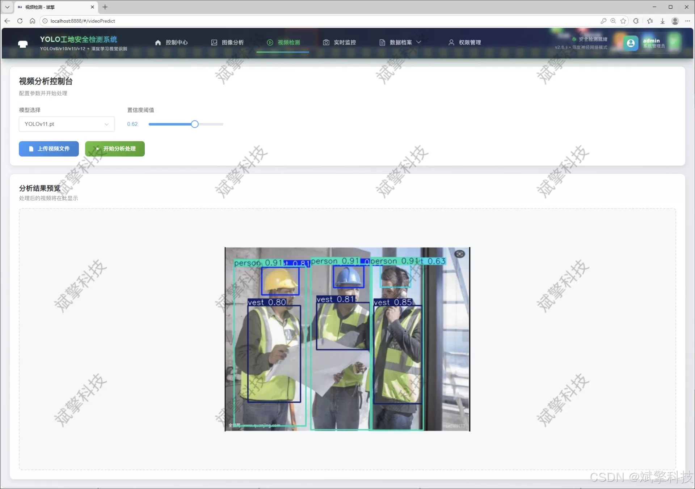
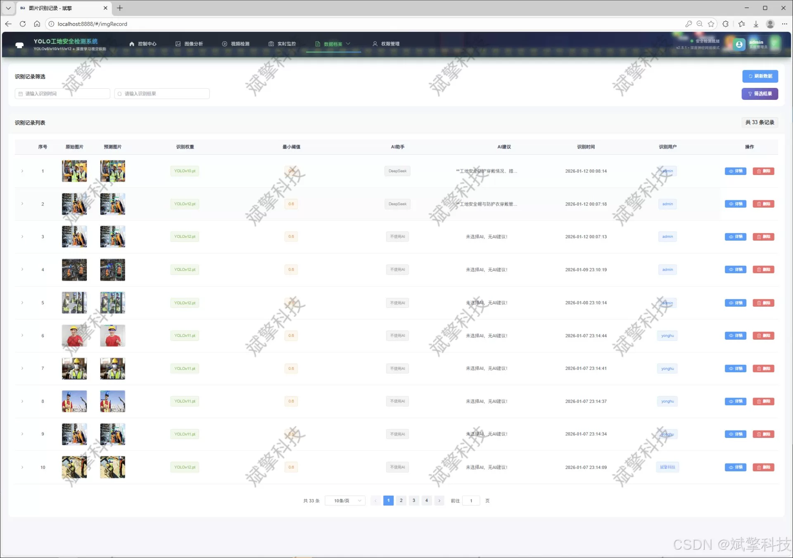
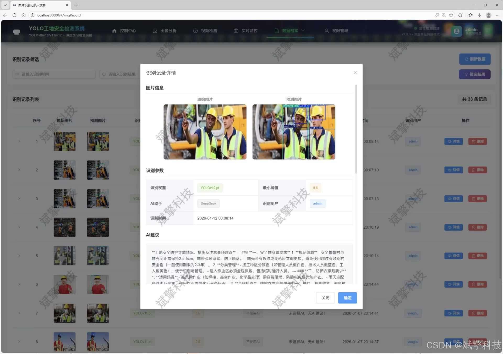
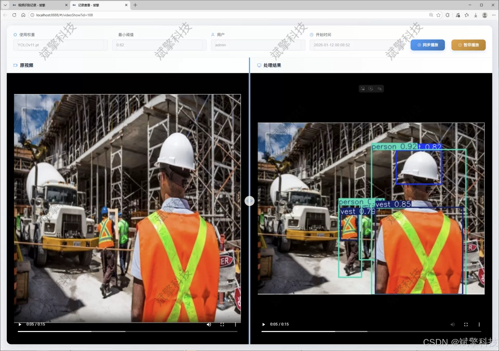
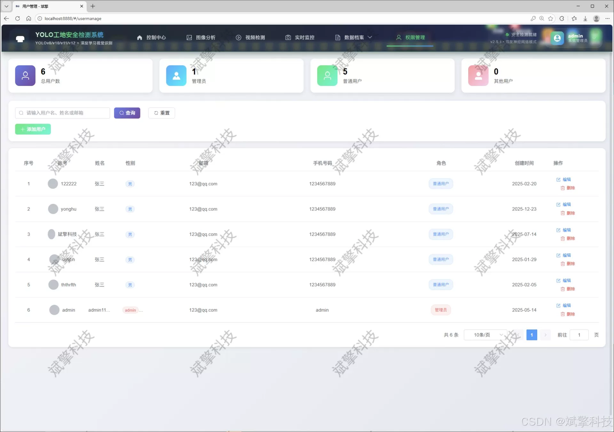

# YOLO construction site safety inspection

## Body

The construction site safety detection system based on YOLO deep learning and the large models of Qianwen and DeepSeek is a system that uses YOLO data, YOLOv8/YOLOv10/YOLOv11/YOLOv12 for intelligent analysis. The system includes a web interface for interaction.

This project is dedicated to building an efficient, intelligent, and user-friendly construction site safety helmet and protective clothing inspection system. The goal is to enhance the safety management level of construction sites through advanced computer vision technology. The system integrates cutting-edge YOLO series object detection algorithms with modern SpringBoot backend frameworks, and integrates DeepSeek intelligent analysis engine, achieving a comprehensive, scalable, and good interaction experience Web application platform. The core goal is to automatically identify whether personnel in the monitoring scene are wearing safety helmets and protective clothing as required, thereby realizing real-time warnings and standardized management of unsafe behaviors, effectively preventing accidents at construction sites.

The system adopts a front-end separation architecture design, providing an intuitive Web interaction interface on the front end. The backend is built based on SpringBoot to create high concurrency and maintainable RESTful API services. At the algorithmic level, the system innovatively supports dynamic switching and comparison applications of four latest generations of YOLO models: YOLOv8, YOLOv10, YOLOv11, and YOLOv12, endowing the system with excellent adaptability and flexibility in terms of detection accuracy and inference speed. The model was trained for specific scenarios in construction sites, using customized datasets that include five categories: helmet (helmet), no-helmet (no safety helmet), vest (vest), no-vest (no protective clothing), and person (person), totaling 1,206 labeled images (997 training set, 119 validation set, and 90 test set). This ensures the robustness of the model's recognition of complex environments in construction sites.

Functional module

✅ User Login and Registration: Supports password detection, saves to MySQL database.

✅ Supports four YOLO model switches, YOLOv8, YOLOv10, YOLOv11, YOLOv12.

✅ Information Visualization, Data Visualization.

✅ Image detection supports AI analysis functions, deepseek and Qianwen.

✅ Supports image detection, video detection, and real-time camera detection. The results are saved to a MySQL database.

✅ Picture recognition record management, video recognition record management and camera recognition record management.

✅ User Management Module, administrators can add, delete, modify, and query users.

✅ Personal center, can modify their own information, password name profile picture and so on.

There is no Lunwen writing service, nor any Lunwen.

## Images

## Payment

Here is a pay link on Stripe ( https://buy.stripe.com/3cs8yP7sY87d0vu9AB ). Please contact me lonlonago@foxmail.com after funding $89, and I will send you a complete data files , thank you!

